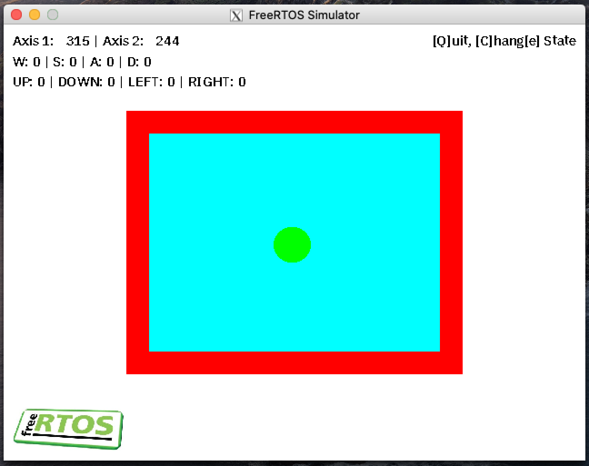

# FreeRTOS Emulator using Docker Containers

> :warning: **WORK IN PROGRESS!**



## Prerequisites

The approach for the emulator is based on Docker-Desktop and X11 which is heavily OS-dependent. To make the usage more generic a Makefile (See `docker/Makefile`) is available. The the folowing sections the initial required steps for setting up the development environment

### General

Assuming you have Git installed on you computer, run the following in any shell you like to check out the Emulator branch of this repository.

```bash
git clone https://github.com/PhilippvK/FreeRTOS-Emulator.git
cd FreeRTOS-Emulator
git checkout emulator
git submodule update --init --recursive
cd docker # Main working directory for Emulator tasks
```

### Debian/Ubuntu

Should be quite straightforward as an X Window Server is installed by default.

- Install Docker-Engine (https://docs.docker.com/install/linux/docker-ce/ubuntu/) and Docker Compose (https://docs.docker.com/compose/install/) by following the instructions
- This should be it.

> :warning: **Keep in mind: The authorization for the X11 Connection is implemented in a quite insecure way, which should normally not be a problem but can be improved at a later point**

### ARCH

TODO (probably similar to Debian-based systems)

### Windows

The initial setup is a little setup as docker commands have to be run in a Powershell Environment while the GNU Make utility requires UNIX-like tools.

- Download & Install MSYS2 (https://www.msys2.org, 64 bit version)
- Update `PATH` to include MinGW executables (Change `C:\msys64\` if you have chosen different installation directory)
```powershell
[Environment]::SetEnvironmentVariable("PATH", "$ENV:PATH;c:\msys64\usr\bin", "USER")
$env:Path = [System.Environment]::GetEnvironmentVariable("Path","Machine") + ";" + [System.Environment]::GetEnvironmentVariable("Path","User")
```
- Install Docker-Desktop (https://hub.docker.com/editions/community/docker-ce-desktop-windows)
- Enable Hyper-V Feature in Windows
Open Powershell with Admin Privileges and run:
```powershell
Enable-WindowsOptionalFeature -Online -FeatureName Microsoft-Hyper-V -All
```
- Reboot the Computer
- Install VcXsrv Windows X Server (VcXsrv Windows X Server)
- Start `XLaunch` and configure it using the default until you get to Extra Settings where you have to ensure, that "disable access control" is checked. Save the Configurating. The X Window Server should be running now. (Make sure, that software like `Xming` (OLD) is NOT running in parallel)
- The Configuration file (`C:\Users\USERNAME\AppData\Roaming\Xming\config.xlaunch`) should look similar to this:
```xml
<?xml version="1.0"?>
<XLaunch xmlns="http://www.straightrunning.com/XmingNotes" xmlns:xsi="http://www.w3.org/2001/XMLSchema-instance" xsi:schemaLocation="http://www.straightrunning.com/XmingNotes XLaunch.xsd" WindowMode="MultiWindow" ClientMode="NoClient" Display="0" Clipboard="true" NoAccessControl="true"/>
```
You can also use PowerShell to pass the Configuration when Starting XLaunch:
```powershell
C:\ProgramData\Microsoft\Windows\Start Menu\Programs\Xming> .\XLaunch.lnk -run $env:APPDATA\config.xlaunch
```
- This should be it (Do not forget to start XLaunch before trying to run the Emulator!)

### MacOS

TODO
```bash
sudo pacman -S sdl2 sdl2_gfx sdl2_image sdl2_mixer sdl2_ttf
```

## Remarks

- Be aware of the fact, that the docker container used for the Emulation will not stop running automatically. Make sure to stop it using `make down` or respectively `docker stop/kill/...`

## Drawbacks

- Anything related to Audio/Sound will not work as X11 Forwarding does not implement such feature
- Depending on the Host OS, the performance (especially in terms of framerate). I made the observation, that MacOS performance is impacted the most while Linux and Windows perform almost like the native application (especially if a dedicated GPU is available for HW acceleration)
- IDE Support (Eclipse/VSCode) is not there, yet.
- Debugging issues (like ASLR)

## Usage

irst, enter the `docker` directory from the top level of the cloned repository. (If you can not find it, make sure that you are on the `emulator` branch. Also do not forget to initialize the submodule like explained above
)

### General

The following make targets are available to manage the docker container itself
```bash
make up      # Create & Start the Docker Machine (It will download the image on the first run)
make start   # Start the Docker Machine if it is not running
make stop    # Shut down the Docker Machine (All local changes will be lost)
make reload  # Re-Initialize the Docker Machine by performing a restart
make destroy # Stop the Docker Machine and remove it. (The image will stay cached)
```

### Comiling

Use this target to trigger a compilation. Preliminary dependenzies are automatically run beforehand.
```bash
make compile
```

If you want to re-run cmake, run `make reload`

### Running / Debugging

The following command should do the job
```bash
make     # Default target
make run # Run the Emulator inside the Docker Machine after Compilation
```

A debugging session can be started via
```bash
make debug # Should launch a GDB Session in TUI (Text User Interface) Mode
```

You can configure the GDB options by editing `../bin/.gdbinit`

## Contribution

If you want to add features to the Emulator, feel free to do this. Changes of the docker image can be implemented in the https://github.com/PhilippvK/docker-freertos-sdl2 repository. You might also want to use `docker-compose`, f. e. to access the logs using `docker-compose -f docker-freertos-sdl2/docker-compose.yml logs`.

## Common Problems

TODO

## Documentation

Documentation of the crude graphics library, found in `lib/Gfx`, and the example collision demo code library, can be generated by running

``` bash
doxygen
```
from the `docs` directory to generate the Doxygen documentation. Also generated on GitHub via Travis CI, available [*here*](https://alxhoff.github.io/FreeRTOS-Emulator/).

## Asynchronous IO

There are three implemented methods to perform asynchronous IO, with the hope of emulating the sort of IO you find on micro-controllers. The three methods are UDP and TCP sockets and POSIX message queues.

### TCP/UDP Sockets

Both protocols have the same functionality, differing only in that the UDP callback is called for every received transmission whilst the TCP callback is called for every established connection. Both work by establishing a connection to the given IPv4 dot-decimal address and port.

### POSIX Message Queues

Similarly to UDP sockets, message queues trigger their callback once for each message received. The message queue names, unlike the Linux POSIX implementation, do not require the prepending '/'.

### Callbacks

Each type of connection can be assigned its own callback function. The callback, if provided (else `NULL`), must take three arguments: `size_t`, `char *`, `void *`. These parameters, respectively, provide the callback with the number of bytes received into the buffer, the buffer and the args given as an argument when the connection was created.

### Sending to Connections

`aIOMessageQueuePut` and `aIOSocketPut` can be used to send a `char *` buffer to either a message queue (specified using the message queue's name) or a socket (specified using an IPv4 dot-decimal address and a port).

## Example

TODO

## YouCompleteMe Integration

This is not really related to the project but as I have left in the YCM symlinks and options in the CMake I may as well detail the YouCompleteMe Vim integration as it is applicable for other projects as well.

### Install vim-plug

#### Ubuntu users

Ubuntu does not yet install vim 8.X+ by default and as you must install it manually first

``` bash
sudo add-apt-repository ppa:jonathonf/vim
sudo apt update
sudo apt install vim
```
#### Installation

##### Prerequisites

A python version >= 3.5 is required.

``` bash
sudo apt install build-essential cmake3 python3.5-dev python3.5
```

##### Vim plugin manager

``` bash
curl -fLo ~/.vim/autoload/plug.vim --create-dirs \
    https://raw.githubusercontent.com/junegunn/vim-plug/master/plug.vim
```

##### YCM

Add YCM to vimrc

``` bash
echo "call plug#begin('~/.vim/plugged')" >> $HOME/.vimrc
echo "Plug 'valloric/youcompleteme'" >> $HOME/.vimrc
echo "call plug#end()" >> $HOME/.vimrc
```

Start vim and run `:PlugInstall`

Navigate to vim plugin folder and run install script

```bash
cd $HOME/.vim/plugged/youcompleteme
python3.5 install.py --clang-completer
```
Get the config script

``` bash
curl -Lo $HOME/.ycm_extra_conf.py https://raw.githubusercontent.com/alxhoff/dotfiles/master/ycm/.ycm_extra_conf.py
```

After running, you should be able to complete using CRTL+Space
